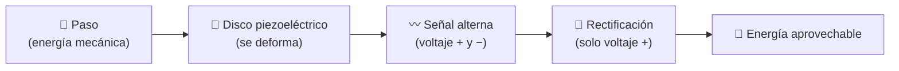

<div align="center">

# ⚡ SIREP 👣
### *Cada paso cuenta: convierte tu caminar en electricidad*


**🌐 [Visita la página interactiva](https://TU-USUARIO.github.io/sirep/)** · **🧪 [Ver evidencias](#-evidencias-y-resultados)** · **📚 [Aprende la ciencia](#-la-ciencia-explicada-sin-dolor)**

</div>

---

## 📖 Índice

1. [¿Qué es SIREP?](#-qué-es-sirep)
2. [El problema](#-el-problema-energía-que-se-pierde-a-diario)
3. [La solución](#-la-solución-una-baldosa-que-escucha-tus-pasos)
4. [La ciencia explicada sin dolor](#-la-ciencia-explicada-sin-dolor)
5. [Cómo usar la baldosa (¡y cómo NO!)](#-cómo-usar-la-baldosa-y-cómo-no)
6. [Evidencias y resultados](#-evidencias-y-resultados)
7. [Retos y lecciones aprendidas](#-retos-limitaciones-y-lecciones-aprendidas)
8. [Conclusión](#-conclusión)
9. [Equipo](#-el-equipo)
10. [Estructura del repositorio](#-estructura-del-repositorio)

---

## 💡 ¿Qué es SIREP?

**SIREP** es una **baldosa que genera energía eléctrica cuando alguien camina sobre ella**. Con un solo paso, la presión del pie se transforma en **voltaje** que podemos medir, registrar y, en el futuro, aprovechar.

> 🎯 **Nuestra meta:** demostrar que la energía de nuestros movimientos dentro del colegio no tiene por qué perderse.

---

## 🚨 El problema: energía que se pierde a diario

| 🔎 Aspecto | 📝 Descripción |
|---|---|
| **Problema** | Dentro del colegio se **desperdicia energía mecánica**: miles de pasos al día que no se aprovechan. |
| **¿A quién afecta?** | A **todas las personas de la institución**: estudiantes, docentes y personal. |
| **Contexto** | En nuestro país, el aprovechamiento de la energía mecánica **todavía no es una práctica común**. |

🤔 **Piénsalo:** cada recreo, cada cambio de clase y cada llegada o salida llena los pasillos de movimiento. Toda esa energía se disipa en forma de calor y sonido.

---

## 🧩 La solución: una baldosa que escucha tus pasos

Una baldosa con **discos piezoeléctricos** en su interior. Al recibir presión de forma continua, los discos generan una pequeña señal eléctrica.



---

## 🔬 La ciencia explicada sin dolor

> 📌 **Antes de empezar:** basta con saber que la energía **no se crea ni se destruye, solo se transforma**.

<details>
<summary><b>💎 1. Piezoelectricidad: cristales que "sienten" la presión</b></summary>

<br>

Algunos materiales, como ciertos cristales y cerámicas, tienen una propiedad curiosa: **si los aprietas o los doblas, producen electricidad**. A eso se le llama *piezoelectricidad* (del griego *piezo*, "presionar").

🧠 **Imagina** una esponja llena de agua: al apretarla, el agua sale. En un material piezoeléctrico, al apretarlo, lo que "sale" son **cargas eléctricas**.

Los encendedores de chispa de cocina funcionan así: un golpe seco sobre un cristal genera la chispa.
</details>

<details>
<summary><b>🔄 2. Transformación de energía: del pie a la electricidad</b></summary>

<br>

| Etapa | Forma de energía |
|---|---|
| 👣 Tu paso | **Mecánica** (movimiento y fuerza) |
| 💎 Dentro del disco | Deformación del material |
| ⚡ A la salida | **Eléctrica** (voltaje) |

Nada se inventa: la energía de tu paso **cambia de forma**. Parte se pierde en calor y vibración, y por eso el voltaje es pequeño.
</details>

<details>
<summary><b>〰️ 3. Rectificación de una onda: ordenando la corriente</b></summary>

<br>

Un disco piezoeléctrico no entrega voltaje "recto". Al presionar, la señal sube; al soltar, **baja y se vuelve negativa**. Es una **onda alterna**, como un columpio que va y viene.

Para guardar la energía en una batería o condensador necesitamos que vaya en un solo sentido. Eso hace un **rectificador** (por ejemplo, un puente de diodos): **voltea las partes negativas hacia arriba**.

```
Antes (alterna)        Después (rectificada)
   /\    /\               /\  /\  /\  /\
 -/--\--/--\-    →      -/--\/--\/--\/--\-
      \/    \/
```

✅ **Resultado:** una señal que solo empuja en una dirección y se puede almacenar.
</details>

---

## 🚶 Cómo usar la baldosa (¡y cómo NO!)

> ### ⚠️ ¡SIREP NO es una plataforma para saltar!
> Los discos piezoeléctricos son **delicados**. Un uso brusco los puede dañar.

| ✅ Sí hacer | ❌ No hacer |
|---|---|
| Pisar **de forma normal**, como al caminar | **Saltar** o brincar encima |
| Pararse con calma sobre la baldosa | Dejar caer objetos pesados |
| Pasar **una persona a la vez** | Subirse en grupo |
| Cuidar la baldosa como un instrumento científico | Golpearla o pisarla con fuerza para "probarla" |

🛡️ **Recuerda:** exigirla de más no genera más energía, **solo la rompe**.

---

## 🧪 Evidencias y resultados

### 🔭 Pruebas realizadas

| # | Tipo de prueba | ¿Qué demuestra? | Estado |
|---|---|---|---|
| 1 | 💻 **Simulaciones** | Comportamiento esperado antes de construir | ✅ |
| 2 | ⚖️ **Comparación con otra solución** | Ventajas y límites frente a una alternativa | ✅ |
| 3 | 🛠️ **Pruebas físicas de funcionamiento** | Que la baldosa realmente genera voltaje | ✅ |
| 4 | 📏 **Mediciones experimentales** | Valores reales de voltaje | ✅ |
| 5 | 📷 **Fotografías y capturas de pantalla** | Registro del proceso | ✅ |
| ⭐ | 📟 **Osciloscopio** | Visualizar la señal eléctrica | ✅ |

### ⭐ Prueba estrella: la señal bajo el osciloscopio

Un **osciloscopio** es como un "electrocardiograma" de la electricidad: dibuja cómo cambia el voltaje en el tiempo. Con él **vimos la señal de un paso**.

<!-- 👉 Reemplaza con tu imagen real -->
<p align="center">
  
  <br><i>📸 Señal generada por un paso, capturada en el osciloscopio</i>
</p>

### 📊 Demostraciones

| 🎬 Demostración | 📌 Resultado |
|---|---|
| ⚡ **Voltaje generado** | `[COMPLETAR: valor medido, ej. X V pico]` |
| 🏋️ **Capacidad de carga (límite de peso)** | `[COMPLETAR: peso máximo soportado]` |

### 🖼️ Galería

<p align="center">
  
  
</p>

---

## 🧗 Retos, limitaciones y lecciones aprendidas

> 💬 *Un proyecto científico no solo muestra lo que funcionó: también lo que nos enseñó cuando falló.*

| 🔧 Reto | 📖 Qué pasó |
|---|---|
| **Materiales frágiles** | Los materiales comerciales resultaron **muy delicados** y no soportan un peso alto. |
| **Soldaduras que se rompen** | Los puntos de soldadura de los discos **se quebraban constantemente**, incluso con protección. |

### 🎓 Lecciones aprendidas

1. 🧱 **Un buen diseño no basta:** los materiales determinan lo que realmente se puede lograr.
2. 🔌 **Las conexiones son un punto débil:** una soldadura rota detiene todo el sistema.
3. 🔁 **Fallar también es resultado:** cada fallo nos dijo qué cambiar.

---

## ✅ Conclusión

> ### 🏁 Los piezoeléctricos comerciales estándar **no son viables para proyectos de alto peso o tráfico pesado**.

**Sí funcionan** para demostrar el principio con cargas pequeñas, como se vio en las pruebas. Para pasillos con mucha gente harían falta materiales más robustos o un diseño que proteja los discos de la carga directa.

---

## 👥 El equipo

| 👤 Integrante |
|---|
| **Matthew Colmenares** |
| **Santiago García** |
| **Jerónimo Guerrero** |
| **Mariana Moyano** |

---

## 📁 Estructura del repositorio

```
sirep/
├── 📄 README.md          ← Estás aquí
├── 🌐 index.html         ← Página web interactiva (GitHub Pages)
├── 📜 LICENSE
└── 📂 assets/
    └── 📂 img/           ← Fotos, capturas y osciloscopio
```

---

<div align="center">

### 🙌 ¿Te gustó SIREP? Dale una ⭐ al repositorio y comparte el proyecto con tu comunidad.

*Hecho con ⚡ y curiosidad por estudiantes de nuestro colegio.*

</div>
